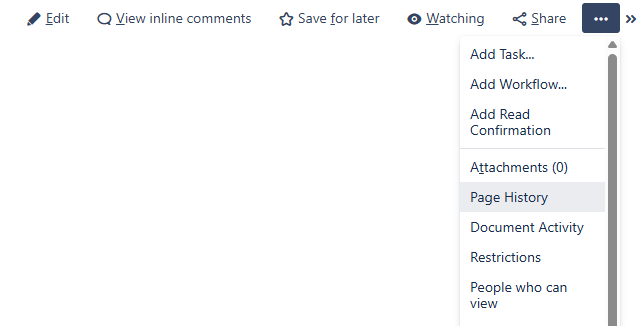
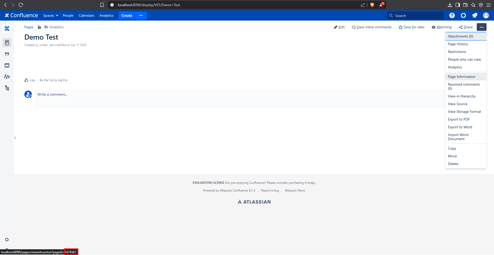
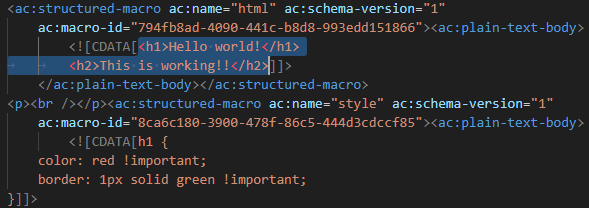

# Confluence Test Suite for VS Code

A VS Code extension that runs Confluence Server in Docker containers and lets you edit Confluence content directly in VS Code.
A VS Code extension that runs Confluence Server in Docker containers and lets you edit Confluence content directly in VS Code.

## Features

- Run Confluence Server locally in Docker
- Use PostgreSQL for database persistence
- Import Confluence pages into VS Code
- Edit content while preserving Confluence formatting
- Export content back to Confluence

## Installation

Install from the VS Code Marketplace

## Requirements

- Docker installed and running
- VS Code 1.60.0 or newer
- Permission to run Docker commands

## How to use

### Starting Confluence

1. Open Command Palette (Ctrl+Shift+P)
2. Run `Confluence Test Suite: Start Container`
3. Wait for both PostgreSQL and Confluence containers to initialize
4. Complete the first-time Confluence setup in your browser when prompted

### Database setup (first run only)

If Confluence asks for database details during setup:
- Database Type: PostgreSQL
- Hostname: vscode-confluence-postgres
- Port: 5432
- Database Name: confluence
- Username: confluence
- Password: confluence_password

## Finding page IDs

The page ID can be found when clicking the 3 dots in the top right of a page and hovering over one of the dropdown options. Click on one of the options or look at the URL preview in the bottom left corner of your browser window.

http://localhost:8090/pages/viewinfo.action?pageId=1474561

In this example, the page ID is `1474561`.

### Importing content

1. Run `Confluence Test Suite: Import Content from Confluence`
2. Enter your Confluence credentials
3. Enter the page ID of the page you want to import
4. The content will open in VS Code with formatting preserved

Suggested use: if there are customized macros you'd like to use, recommend creating the page in the confluence environment first and preconfiguring the macros there, then when you are ready to edit import that page in storage format. Make changes within the CDATA brackets to edit the contents of that macro.

### Editing and exporting

This command will send whatever is in the current editor to the page.  
1. Edit the imported content in VS Code
2. Run `Confluence Test Suite: Export Code to Confluence`
3. Choose to update the original page or create a new one
4. View the updated page in your browser

### Stopping Confluence

Run `Confluence Test Suite: Stop Container` to stop both containers.

## Available commands

- `Confluence Test Suite: Start Container` - Starts Confluence and PostgreSQL
- `Confluence Test Suite: Stop Container` - Stops both containers
- `Confluence Test Suite: Check Container Status` - Shows container status
- `Confluence Test Suite: Import Content from Confluence` - Imports a page
- `Confluence Test Suite: Export Code to Confluence` - Sends content to Confluence

## Notes

- Content is stored in PostgreSQL for persistence
- All Confluence macros and formatting are preserved during import/export
- Default ports: Confluence (8090), PostgreSQL (5432)